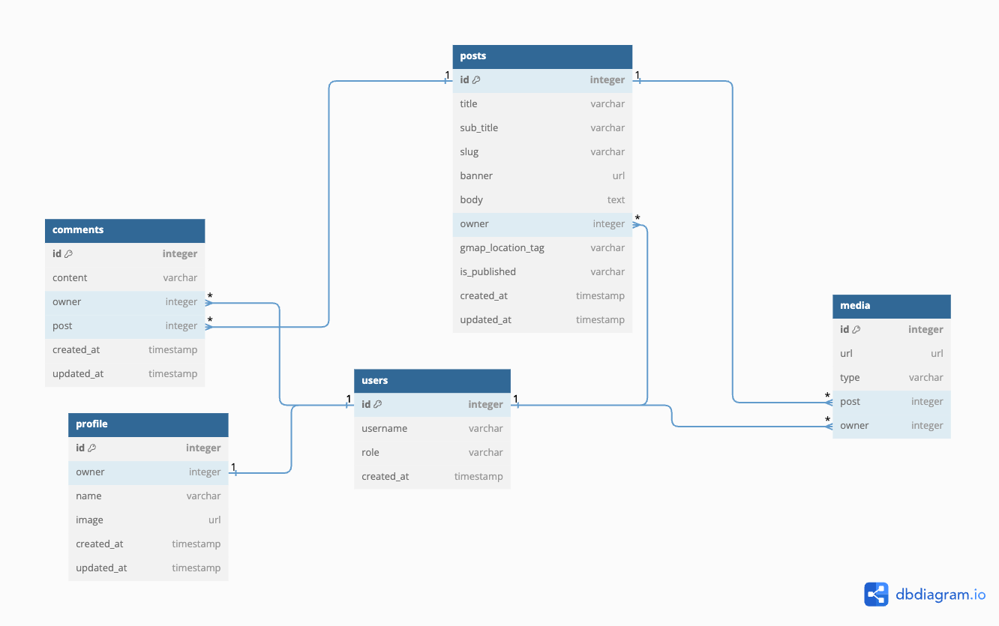
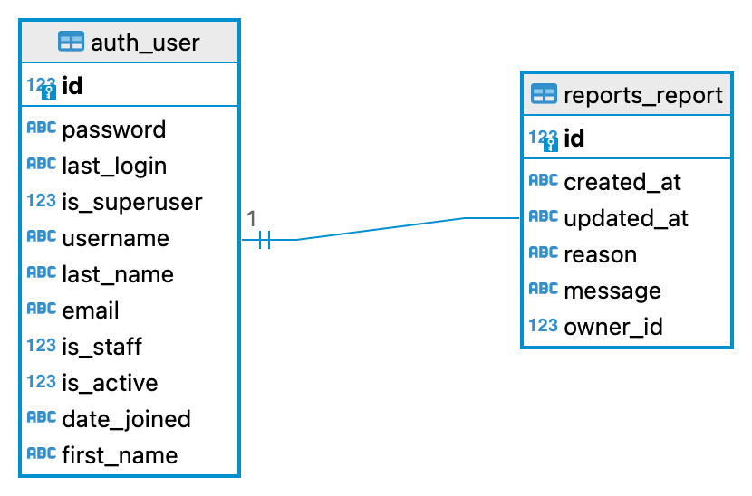

# Traveler's Diary API

## DB Design

## API Design
This section shows the Overall REST API design in a tabular format. This provides an easier reference to the API and the
API design of the service.

### User profile API
This section shows the user profile API endpoints with the HTTP method, intended operation and the target view in a possible
user interface. Reference: Code Institute [drf-ap](https://github.com/Code-Institute-Solutions/drf-api)

#### Security policy
- Authenticated users can view any user profile and edit their own profile.
- Unauthenticated users can view their user profile and other user profiles.

| HTTP   | URI           | Operation            | View    | Comment                     |
|--------|---------------|----------------------|---------|-----------------------------|
| GET    | /profiles     | View all profiles    | List    |                             |
| POST   | /profiles     | Create user profile  | List    | Triggered by user creation  |
| GET    | /profiles/:id | Get profile by id    | Details |                             |
| PUT    | /profiles/:id | Edit profile by id   | Details |                             |
| DELETE | /profiles/:id | Delete profile by id | Details | Admin performs the deletion |

### Posts API
This section shows the API design for the posts API endpoints with the HTTP methods.

#### Security policy
- Authenticated users can create new posts and edit or delete their own posts.
- Any user can view published posts

| HTTP   | URI        | Operation          | View              | Comment |
|--------|------------|--------------------|-------------------|---------|
| GET    | /posts     | View all the posts | List              |         |
| POST   | /posts     | Create a post      | List              |         |
| GET    | /posts/:id | Get post by id     | Article View,Edit |         |
| PUT    | /posts/:id | Edit post by id    | Edit              |         |
| DELETE | /posts/:id | Delete post by id  | Edit              |         |

### Comments API
This section shows the API design for the comments API endpoints with the HTTP methods.

#### Security policy
- Authenticated users can create new comments for any post and edit or delete their own comments.
- Any user can view published comments

| HTTP   | URI            | Operation                        | View         | Comment |
|--------|----------------|----------------------------------|--------------|---------|
| GET    | /comments/:id  | View all the comments for a post | Article View |         |   
| POST   | /comments/:id  | Create a comment for a post      | Article View |         |
| PUT    | /comments/:id  | Edit a comment of a post         | Article View |         |  
| DELETE | /comments/:id/ | Delete a comment of a post       | Article View |         |

