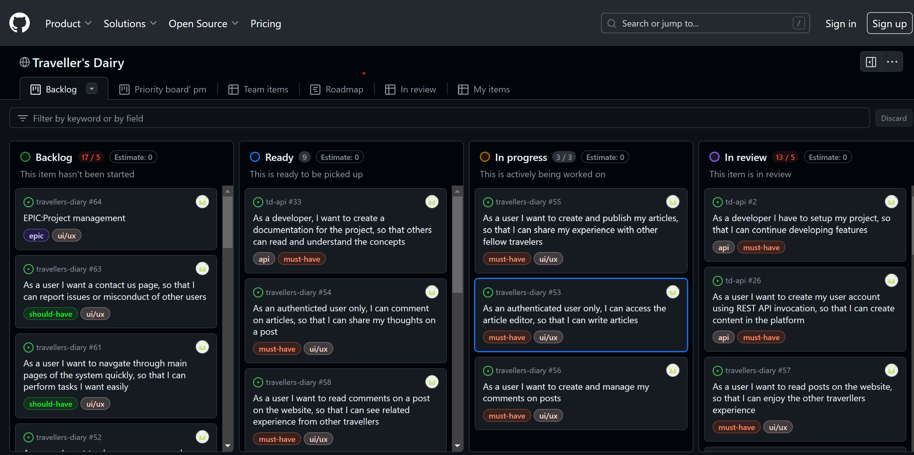

# td-API

td-API is the backend service used by the Traveler's Diary. Traveler's diary is a blog application where users could
record their excursions in a summary format.

<hr>
<br>

## Development Goals

The goal of this API is provide a backend service to allow the Traveller's Diary front end application to perform, Create, Read, Update and Delete operations via the user interface.
<hr>
<br>

## Agile Planning

This project was developed using agile methodologies by delivering small features in incremental sprints. There were 3 sprints in total, spaced out evenly over three weeks.

All stories were assigned to epics, prioritized under the labels, Must have, should have, could have and assigned to sprints. "Must have" stories were completed first, "should haves" and then finally "could haves". 

The Kanban board was created using Github projects and can be located [https://github.com/users/chathugaj/projects/3](https://github.com/users/chathugaj/projects/3) Github board link TO DO) and can be viewed to see more information on the project cards.Only user stories have acceptance critieria to define the certain excecution.



**Project Management**

This Epic covers all the initial setup of the Django application and Django REST Framework in order to begin coding the features.

**User Creation**

This epic covers all user creation related user stories.

**Manage posts**

This Epic covers all API endpoint creation and database connections relating to the CRUD functionality of user posts. This includes like activity.

**Comments and Likes management**

This Epic covers all API endpoint creation and database connections relating to the CRUD functionality of user comments in relation to posts.

**Security**

This Epic covers all API endpoint creation and database connections relating to the CRUD functionality of user created profiles. This includes following functionality.

**Contact us**

This epic covers all the API endpoints related to the contact us / user reports functionality.

<hr>
<br>

### User Stories

**By Epics** 

**Project Management**

*As a developer I have to setup my project, so that I can continue developing features. 
*As a developer I want my application deployed in heroku, so that users can start using it.

*As a developer, I want to create a documentation for the project, so that others can read and understand the concepts.


**User Creation**
*As a user I want to create my user account using REST API invocation, so that I can create content in the platform.
*As a user I want to create my user account using REST API invocation, so that I can create content in the platform.


**Comments and Likes management**
*As a developer I want to manaege comments through the REST API. 
*As a developer I want to manage likes to posts through the REST API. 
*API: As a logged In User, I need to be able to create, view, edit and delete comments for an article in the website through an API.

**Manage Posts**
*API: As a Logged In User, I need to be able to create, view, edit and delete a post in the website through an API.

**Contect Us**
*As a developer I want the contact requests created through REST API.

**Security**
*As a developer I want users to authenticate using the REST API, so that they will be able to access all the features in the platform.
*As a developer I want users to use the obtained token when invoking API endpoints, so that the API will know the user is authenticated.
*API: As a developer, I want my API URLs secure so no can perform unauthorized modifications to the the data. 


### API Endpoints

User Story:
-As a developer I have to setup my project, so that I can continue developing features. 

Implementation:

Setup the project in the local machine by creating skeletons using django framework, updating the settings.py
file, creating an env.py file to be used as the secure source of configs locally.


User Story:
-As a developer I want my application deployed in heroku, so that users can start using it.

Implementation:

Configure heroku project, setup deployment and configurations.

User Story:
-As a developer, I want to create a documentation for the project, so that others can read and understand the concepts.

Implementation:
Adding a readme file with necessary information.

User Story:
-As a user I want to create my user account using REST API invocation, so that I can create content in the platform.

Implementation:
Design and implement profiles API module. Refer to the API design section.


User Story:
-As a developer I want to manaege comments through the REST API. 

Implementation:
Design and implement comments API module. Refer to the API design section.

User Story:
-As a developer I want to manage likes to posts through the REST API. 

Implementation:
Design and implement likes API module. Refer to the API design section.


User Story:
API: As a logged In User, I need to be able to create, view, edit and delete comments for an article in the website through an API.

Implementation:
Design and implement the posts API. Refer the API design section.

User Story:
As a developer I want the contact requests created through REST API.

Implementation:
Design and implement reports module, users can contact the administrators for concerns and questions. Refer the API 
design section

User Story:
As a developer I want users to authenticate using the REST API, 
so that they will be able to access all the features in the platform.

Implementation:
User is authenticated through an API and authorized to access the relevant API endpoints

User Story:
API: As a developer, I want my API URLs secure so no one can perform unauthorized modifications to the data.

Implementation:
Necessary implentations are done using django auth permissions module.

## API Design
This section shows the Overall REST API design in a tabular format. This provides an easier reference to the API and the
API design of the service.

### User profile API
This section shows the user profile API endpoints with the HTTP method, intended operation and the target view in a possible
user interface. Reference: Code Institute [drf-ap](https://github.com/Code-Institute-Solutions/drf-api)

#### Security policy
- Authenticated users can view any user profile and edit their own profile.
- Unauthenticated users can view their user profile and other user profiles.

| HTTP   | URI           | Operation            | View    | Comment                     |
|--------|---------------|----------------------|---------|-----------------------------|
| GET    | /profiles     | View all profiles    | List    |                             |
| POST   | /profiles     | Create user profile  | List    | Triggered by user creation  |
| GET    | /profiles/:id | Get profile by id    | Details |                             |
| PUT    | /profiles/:id | Edit profile by id   | Details |                             |
| DELETE | /profiles/:id | Delete profile by id | Details | Admin performs the deletion |

### Posts API
This section shows the API design for the posts API endpoints with the HTTP methods.

#### Security policy
- Authenticated users can create new posts and edit or delete their own posts.
- Any user can view published posts

| HTTP   | URI        | Operation          | View              | Comment |
|--------|------------|--------------------|-------------------|---------|
| GET    | /posts     | View all the posts | List              |         |
| POST   | /posts     | Create a post      | List              |         |
| GET    | /posts/:id | Get post by id     | Article View,Edit |         |
| PUT    | /posts/:id | Edit post by id    | Edit              |         |
| DELETE | /posts/:id | Delete post by id  | Edit              |         |

### Comments API
This section shows the API design for the comments API endpoints with the HTTP methods.

#### Security policy
- Authenticated users can create new comments for any post and edit or delete their own comments.
- Any user can view published comments

| HTTP   | URI           | Operation                        | View         | Comment |
|--------|---------------|----------------------------------|--------------|---------|
| GET    | /comments/    | View all the comments for a post | Article View |         |   
| POST   | /comments/:id | Create a comment for a post      | Article View |         |
| PUT    | /comments/:id | Edit a comment of a post         | Article View |         |  
| DELETE | /comments/:id | Delete a comment of a post       | Article View |         |


### Likes API
This section shows the API design for the Likes API endpoints with the HTTP methods.

#### Security policy
- Authenticated users can like any post and remove the like later if they want to.
- Any user can view published comments

| HTTP   | URI        | Operation                     | View         | Comment |
|--------|------------|-------------------------------|--------------|---------|
| GET    | /likes/    | View all the Likes for a post | Article View |         |   
| POST   | /likes/:id | Create a Like for a post      | Article View |         |
| DELETE | /likes/:id | Delete a Like of a post       | Article View |         |


### Reports (ContactUs) API
This section shows the API design for the Reports API endpoints with the HTTP methods.

#### Security policy
- Authenticated users can create a report through the contact us form.
- Admin users can view reports

| HTTP   | URI          | Operation                          | View            | Comment |
|--------|--------------|------------------------------------|-----------------|---------|
| GET    | /reports/    | View all the Contact Us for a post | Contact Us View |         |   
| POST   | /reports/:id | Create a Contact Us                | Contact Us View |         |

## Database Design


## Security

Sensitive configurations are extracted to env.py for local environment and to Heroku config in the Heroku to make them
secure and not publicly available.
API endpoints that add/modify data is secured so that authentication is required to invoke those endpoints.


## Technologies

* Django
    * Main framework used for application creation
* Django REST Framework
    * Framework used for creating API
* Cloudinary
    * Used for static image hosting
* Heroku
    * Used for hosting the application
* Git
    * Used for version control
* Github
    * Repository for storing code base and docs

<hr>
<br>

## Python Packages

<summary> Details of packages </summary>

https://django-rest-framework-simplejwt.readthedocs.io/en/latest/
https://dj-rest-auth.readthedocs.io/en/latest/

## Testing

Unit tests in posts app

**Validator Results**
[TO DO]


**Bugs and their fixes**

[TO DO]


<hr>
<br>

## Deployment

## Version Control

The site was created using the Visual Studio Code editor and pushed to github to the remote repository.

The following git commands were used throughout development to push code to the remote repo:

```git add <file>``` - This command was used to add the file(s) to the staging area before they are committed.

```git commit -m “commit message”``` - This command was used to commit changes to the local repository queue ready for the final step.

```git push``` - This command was used to push all committed code to the remote repository on github.

<hr>
<br>

## Heroku Deployment

The site was deployed to Heroku. The steps to deploy are as follows:

* Navigate to heroku and create an account
* Click the new button in the top right corner
* Select create new app
* Enter app name
* Select region and click create app
* Click the resources tab and search for Heroku Postgres
* Select hobby dev and continue
* Go to the settings tab and then click reveal config vars
* Add the following config vars:
  * SECRET_KEY: (Your secret key)
  * DATABASE_URL: (This should already exist)
  * ALLOWED_HOST:
  * CLIENT_ORIGIN: url for the client front end react application that wil be making requests to these APIs
  * CLIENT_ORIGIN_DEV: address of the local server used to preview and test UI during development of the front end client application

* Click the deploy tab
* Scroll down to Connect to GitHub and sign in / authorize when prompted
* In the search box, find the repositoy you want to deploy and click connect
* Scroll down to Manual deploy and choose the main branch
* Click deploy

<hr>
<br>


### Run Locally

Navigate to the GitHub Repository you want to clone to use locally:

- Click on the code drop down button
- Click on HTTPS
- Copy the repository link to the clipboard
- Open your IDE of choice (git must be installed for the next steps)
- Type git clone copied-git-url into the IDE terminal

The project will now have been cloned on your local machine for use.

In order to run, you will need to create an env.py file and add the config vars as used in heroku steps above.

### Forking

Most commonly, forks are used to either propose changes to someone else's project or to use someone else's project as a starting point for your own idea.

- Navigate to the GitHub Repository you want to fork.

- On the top right of the page under the header, click the fork button.

- This will create a duplicate of the full project in your GitHub Repository.

## Credits
Django rest framework code references: https://github.com/Code-Institute-Solutions/drf-api
Django Simple JWT getting started: https://django-rest-framework-simplejwt.readthedocs.io/en/latest/getting_started.html


