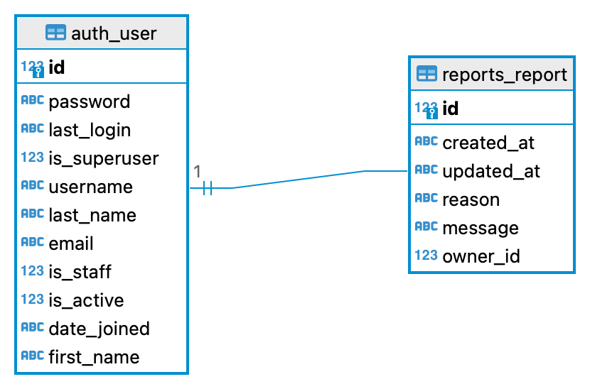
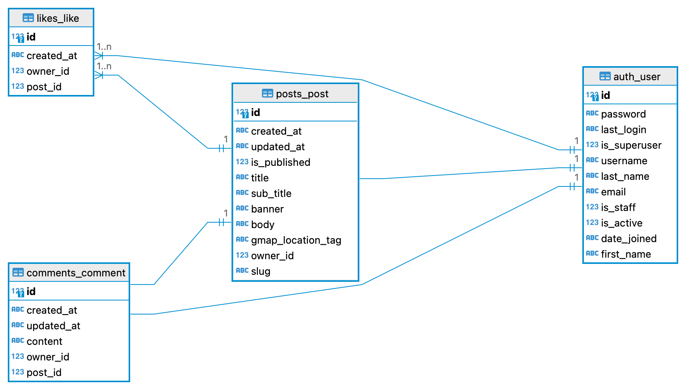

# td - API

td -  API is the backend service used by the [ Application](TO DO).

<hr>
<br>

## Table of Contents
* [Development Goals](#Development-Goals)
* [Agile Planning](#Agile-Planning)
    * [Epics](#Epics)
    * [User Stories](#User-Stories)
* [API End Points](#API-End-Points)
* [Future Features](#Features-Left-to-Implement)
* [Database Design](#Database-Design)
* [Security](#Security)
* [Technologies](#Technologies)
* [Testing](#Testing)
* [Deployment](#Deployment)
    * [Version Control](#Version-Control)
    * [Heroku Deployment](#Heroku-Deployment)
    * [GCP](#Google-Cloud-Platform)
    * [Run Locally](#Run-Locally)
    * [Fork Project](#Fork-Project)
* [Credits](#Credits)
  * [Content](#Content)
  * [Acknowledgements](#Acknowledgements)

## Development Goals

The goal of this API is provide a backend service to allow the Traveller's Diary front end application to perform, Create, Read, Update and Delete operations via the user interface.
<hr>
<br>

## Agile Planning

This project was developed using agile methodologies by delivering small features in incremental sprints. There were 3 sprints in total, spaced out evenly over three weeks.

All stories were assigned to epics, prioritized under the labels, Must have, should have, could have and assigned to sprints. "Must have" stories were completed first, "should haves" and then finally "could haves". 

The Kanban board was created using Github projects and can be located [https://github.com/users/chathugaj/projects/3](https://github.com/users/chathugaj/projects/3) Github board link TO DO) and can be viewed to see more information on the project cards.Only user stories have acceptance critieria to define the certain excecution.


**Set Up**

This Epic covers all the initial setup of the Django application and Django REST Framework in order to begin coding the features.

**Posts**

This Epic covers all API endpoint creation and database connections relating to the CRUD functionality of user posts. This includes like activity.

**Comments**

This Epic covers all API endpoint creation and database connections relating to the CRUD functionality of user comments in relation to posts.

**Profiles**

This Epic covers all API endpoint creation and database connections relating to the CRUD functionality of user created profiles. This includes following functionality.

**Writers**
[TO do]

**Likes**
[TO Do]

<hr>
<br>

### User Stories

**By Epics** 

**Setup**

*As a developer I have to setup my project, so that I can continue developing features. 
*As a developer I want my application deployed in heroku, so that users can start using it.

*As a developer, I want to create a documentation for the project, so that others can read and understand the concepts.


**User Creation**
*As a user I want to create my user account using REST API invocation, so that I can create content in the platform.
*As a user I want to create my user account using REST API invocation, so that I can create content in the platform.


**Comments and Likes management**
*As a developer I want to manaege comments through the REST API. 
*As a developer I want to manage likes to posts through the REST API. 
*API: As a logged In User, I need to be able to create, view, edit and delete comments for an article in the website through an API.

**Manage Posts**
*API: As a Logged In User, I need to be able to create, view, edit and delete a post in the website through an API.

**Contect Us**
*As a developer I want the contact requests created through REST API.

**Security**
*As a developer I want users to authenticate using the REST API, so that they will be able to access all the features in the platform.
*As a developer I want users to use the obtained token when invoking API endpoints, so that the API will know the user is authenticated.
*API: As a developer, I want my API URLs secure so no can perform unauthorized modifications to the the data. 


### API Endpoints

User Story:
-As a developer I have to setup my project, so that I can continue developing features. 

Implementation:[TO DO]


User Story:
-As a developer I want my application deployed in heroku, so that users can start using it.

Implementation:[TO DO]

User Story:
-As a developer, I want to create a documentation for the project, so that others can read and understand the concepts.

Implementation:[TO DO]


User Story:
-As a user I want to create my user account using REST API invocation, so that I can create content in the platform.

Implementation:[TO DO]


User Story:
-As a user I want to create my user account using REST API invocation, so that I can create content in the platform.

Implementation:[TO DO]


User Story:
-As a developer I want to manaege comments through the REST API. 

Implementation:[TO DO]

User Story:
-As a developer I want to manage likes to posts through the REST API. 

Implementation:[TO DO]


User Story:
API: As a logged In User, I need to be able to create, view, edit and delete comments for an article in the website through an API.

Implementation:[TO DO]

User Story:
API: As a Logged In User, I need to be able to create, view, edit and delete a post in the website through an API.

Implementation:[TO DO]

User Story:
As a developer I want the contact requests created through REST API.

Implementation:[TO DO]

User Story:
As a developer I want users to authenticate using the REST API, so that they will be able to access all the features in the platform.

Implementation:[TO DO]

User Story:
As a developer I want users to use the obtained token when invoking API endpoints, so that the API will know the user is authenticated.

Implementation:[TO DO]

User Story:
API: As a developer, I want my API URLs secure so no can perform unauthorized modifications to the the data.

Implementation:[TO DO]


## Database Design





## Security
[TO DO]

## Technologies

* Django
    * Main framework used for application creation
* Django REST Framework
    * Framework used for creating API
* Google Cloud Platform
    * Used for static image hosting
* Heroku
    * Used for hosting the application
* Git
    * Used for version control
* Github
    * Repository for storing code base and docs


<hr>
<br>

## Python Packages

<summary> Details of packages </summary>

[TO DO]


Installed as package dependcies with above installations:
[TO DO]

## Testing

Unit tests in posts app


**Validator Results**
[TO DO]


**Bugs and their fixes**

[TO DO]


<hr>
<br>

## Deployment

## Version Control

The site was created using the Visual Studio Code editor and pushed to github to the remote repository.

The following git commands were used throughout development to push code to the remote repo:

```git add <file>``` - This command was used to add the file(s) to the staging area before they are committed.

```git commit -m “commit message”``` - This command was used to commit changes to the local repository queue ready for the final step.

```git push``` - This command was used to push all committed code to the remote repository on github.

<hr>
<br>

## Heroku Deployment

The site was deployed to Heroku. The steps to deploy are as follows:

* Navigate to heroku and create an account
* Click the new button in the top right corner
* Select create new app
* Enter app name
* Select region and click create app
* Click the resources tab and search for Heroku Postgres
* Select hobby dev and continue
* Go to the settings tab and then click reveal config vars
* Add the following config vars:
  * SECRET_KEY: (Your secret key)
  * DATABASE_URL: (This should already exist)
  * ALLOWED_HOST:
  * CLIENT_ORIGIN: url for the client front end react application that wil be making requests to these APIs
  * CLIENT_ORIGIN_DEV: address of the local server used to preview and test UI during development of the front end client application
  * GOOGLE_APPLICATION_CREDENTIALS:
  * GOOGLE_CREDENTIALS: json file with authentication keys and tokens to access the google cloud bucket where images are stored
  * GS_BUCKET_NAME: name of the bucket to upload images to.

* Click the deploy tab
* Scroll down to Connect to GitHub and sign in / authorize when prompted
* In the search box, find the repositoy you want to deploy and click connect
* Scroll down to Manual deploy and choose the main branch
* Click deploy

[TO DO]

<hr>
<br>


### Run Locally

Navigate to the GitHub Repository you want to clone to use locally:

- Click on the code drop down button
- Click on HTTPS
- Copy the repository link to the clipboard
- Open your IDE of choice (git must be installed for the next steps)
- Type git clone copied-git-url into the IDE terminal

The project will now have been cloned on your local machine for use.

In order to run, you will need to create an env.py file and add the config vars as used in heroku steps above.
[Create Environment Variables locally](TO DO)

**Virtual Environment setup** 

Windows:

```
python -m venv venv \
venv/Scripts/activate \
pip install -r requirements.txt
```

Mac:

```
python -m venv venv \
source venv/bin/activate \
pip install -r requirements.txt
```

### Forking

Most commonly, forks are used to either propose changes to someone else's project or to use someone else's project as a starting point for your own idea.

- Navigate to the GitHub Repository you want to fork.

- On the top right of the page under the header, click the fork button.

- This will create a duplicate of the full project in your GitHub Repository.

## Credits

### Content:
<br>
This article was followed in order to implement [TO DO]


